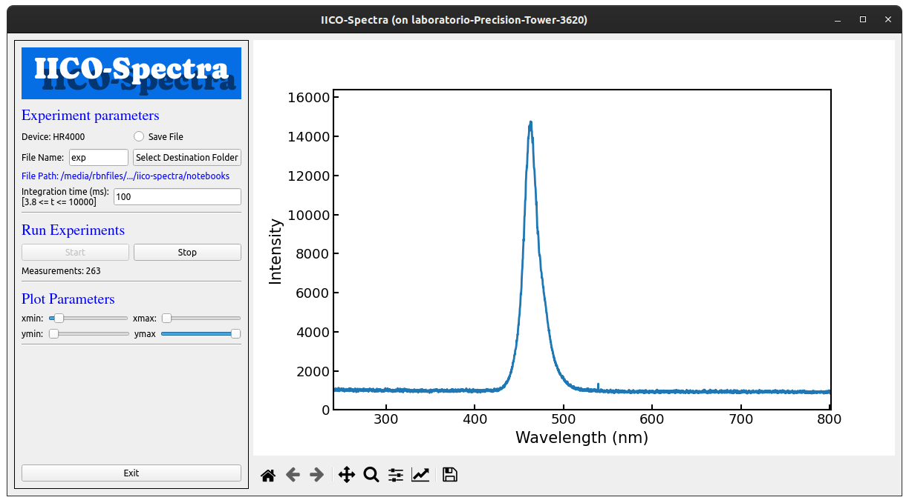

<h1 align="left">IICO-Spectra</h1>

This repository provides a Graphical User Interface (GUI) for conducting spectroscopy experiments using an Ocean Optics spectrometer. The GUI is designed to be user-friendly and intuitive, allowing researchers to easily interact with the spectrometer.

<h2>Installation</h2>
To install and run the spectrometer GUI, follow these steps:

<ol>
  <li> Clone the repository to your local machine:
<pre class='prompt'><code>git clone https://github.com/NanophotonIICOs/iico-spectra.git</code></pre>
</li>
<li> Set up the Anaconda environment to ensure library compatibility:
<pre><code>conda env create -f ispectra.yml</code></pre>
</li>
<li> Run the GUI (within src):
<pre><code>python ispectra.py</code></pre>
</li>
</ol>

<h2>Usage</h2>
<ol>
<li>
 Before running GUI it's recommended to connect the spectrometer.
</li>
  <li>
     After running, you must choose the save data directory. The name input it's optional since the experiments can be saved with sequential number labels. 
  </li>
  <li>
The integration time has a default value (3.8ms) before pushing the start button, you must choose the integration value if it doesn't want you to use the default value.  
</li>
</ol>
  
<h2>Dependencies</h2>
The main library used in this project is python-seabreeze, which provides access to the Ocean Optics spectrometer. The python-seabreeze library ensures compatibility with the spectrometer and allows for seamless integration with the GUI.